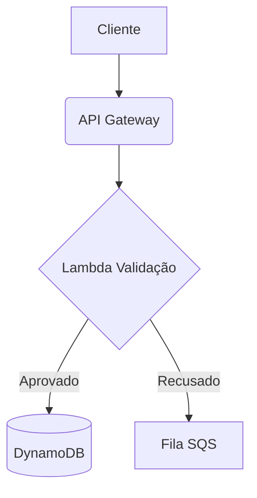

# Resolução — Documentação Completa da Sessão

> **Data:** 20 de fevereiro de 2026 · Atualizado: 23 de fevereiro de 2026  
> **Objetivo:** Aprender a usar o Draw.io como ferramenta de "Docs-as-Code" dentro do VS Code, integrado com IA via MCP.  
> **⚠️ Este arquivo também serve como guia para LLMs futuras** — veja a seção [Guia para LLMs](#-guia-para-llms--setup-rápido-deste-projeto) no final.

---

## ⚠️ Falhas Encontradas na Sessão de 23/02/2026

### Falha 1 — JSON duplicado em `.vscode/mcp.json` e `.vscode/settings.json`
**O que aconteceu:** A IA criou os arquivos de configuração duas vezes em sequência, resultando em JSON inválido (dois objetos raiz concatenados no mesmo arquivo). O VS Code não consegue parsear JSON inválido, portanto o servidor MCP nunca era detectado.

**Causa raiz:** Chamadas duplicadas à ferramenta de criação de arquivos sem verificar se o conteúdo já existia.

**Solução:** Sobrescrever os arquivos com JSON válido (somente um objeto raiz cada).

---

### Falha 2 — `.vscode/mcp.json` criado na subpasta errada
**O que aconteceu:** O arquivo foi criado em `Draw.io/.vscode/mcp.json`, mas o workspace root do VS Code é `/home/gustavofragas/Drawio/`. O VS Code procura `.vscode/` **na raiz do workspace aberto**, não em subpastas do repositório.

**Causa raiz:** Confusão entre a pasta do repositório Git (`Draw.io/`) e a pasta raiz do workspace VS Code (`Drawio/`).

**Solução:** Criar o arquivo em `/home/gustavofragas/Drawio/.vscode/mcp.json`.

**Regra para lembrar:**
```
Workspace root = pasta que você abriu no VS Code (File → Open Folder)
.vscode/ deve ficar dentro dessa pasta, não dentro de subpastas
```

---

### Falha 3 — Terminal travando a cada comando
**O que aconteceu:** Comandos no terminal (ex.: `npx -y @drawio/mcp --version`) travavam sem retornar, bloqueando o fluxo de trabalho da IA.

**Causa raiz:** Ambiente de terminal restrito (Chromebook/Crostini). Processos que tentam interagir com stdin ficam esperando indefinidamente.

**Solução:** Usar a ferramenta de execução de código Python diretamente (sem shell) para operações que precisariam do terminal, e evitar comandos que aguardam input interativo.

---

### Falha 4 — SVG antigo não era removido ao editar o arquivo
**O que aconteceu:** Ao tentar atualizar o diagrama SVG com `replace_string_in_file`, apenas partes do arquivo eram substituídas, deixando lixo do SVG original misturado com o novo conteúdo (resultando em um arquivo com 480+ linhas quando deveriam ser ~55).

**Causa raiz:** O arquivo `.drawio.svg` tinha estrutura complexa com centenas de elementos `<g>` aninhados; substituições parciais não eram suficientes para limpar o conteúdo.

**Solução:** Reescrever o arquivo inteiro de uma vez via Python (`open(..., 'w')`), garantindo conteúdo limpo.

---

### Falha 5 — IPv6 EHOSTUNREACH + EACCES no npm install global
**O que aconteceu:** O comando `npm install -g @drawio/mcp` falhava com dois erros encadeados:
1. `EHOSTUNREACH 2606:4700::6810:b22:443` — npm tentava resolver via IPv6, que não funciona no Crostini (Chromebook)
2. `EACCES` — sem permissão para instalar em `/usr/lib/node_modules/` (sem sudo no Crostini)

**Causa raiz:** O ambiente Crostini (Linux no Chromebook) não suporta IPv6 e não permite escrita em diretórios globais de sistema.

**Solução (2 partes):**
1. **Forçar IPv4:** `NODE_OPTIONS=--dns-result-order=ipv4first npm install -g @drawio/mcp`
2. **Prefix local:** `npm config set prefix '~/.npm-global'` para instalar binários em `~/.npm-global/bin/`

**Binário final instalado em:** `/home/gustavofragas/.npm-global/bin/drawio-mcp`

**Configs atualizadas para usar o binário direto (sem npx):**
```json
{
  "servers": {
    "drawio": {
      "type": "stdio",
      "command": "/home/gustavofragas/.npm-global/bin/drawio-mcp"
    }
  }
}
```

---

### Falha 6 — Extensão Draw.io sobrescrevia o arquivo no disco
**O que aconteceu:** Após reescrever o arquivo `.drawio.svg` via Python, o conteúdo no disco ficava correto. Porém, ao abrir o arquivo no VS Code, a extensão Draw.io Integration carregava sua versão em cache (memória) e sobrescrevia o arquivo no disco quando o editor fazia autosave.

**Causa raiz:** A extensão `hediet.vscode-drawio` mantém o modelo `mxGraphModel` em memória. Quando o arquivo é modificado externamente, ela não recarrega — ela usa a versão antiga do cache e sobrescreve ao salvar.

**Solução:** Fechar a aba do arquivo no VS Code **sem salvar** ("Don't Save") antes de qualquer modificação programática. Após o script gravar o arquivo, reabrir a aba para carregar a versão nova.

---

### Falha 7 — Encoding errado no atributo `content` do SVG
**O que aconteceu:** O diagrama aparecia correto no Draw.io do browser (via MCP `open_drawio_xml`), mas ao gerar o `.drawio.svg` com o XML embutido no atributo `content`, o Draw.io Integration do VS Code não conseguia decodificar e mostrava tela vazia.

**Causa raiz:** O encoding estava incompleto. A cadeia correta do Draw.io é:
```
XML original → encodeURIComponent() → deflate (zlib) → base64
```
O script estava pulando o passo `encodeURIComponent()`, fazendo apenas `deflate(xml) → base64`. Isso corrompia caracteres especiais como `<`, `>`, `&` e acentos.

**Solução em Python:**
```python
import urllib.parse, zlib, base64

xml_escaped = urllib.parse.quote(xml_content, safe='')  # ← ESTE PASSO FALTAVA
compressed = zlib.compress(xml_escaped.encode('utf-8'))[2:-4]  # raw deflate
encoded = base64.b64encode(compressed).decode('utf-8')
```

---

### Falha 8 — SVG renderizado em branco (corpo visual vazio)
**O que aconteceu:** O arquivo `.drawio.svg` gerado tinha o atributo `content` correto (o Draw.io conseguia abrir e editar), mas ao visualizar no preview SVG, no GitHub, ou no Markdown, a imagem aparecia **completamente em branco** — só o fundo.

**Causa raiz:** Um arquivo `.drawio.svg` precisa ter **DOIS conjuntos de dados**:
1. O atributo `content="..."` na tag `<svg>` (para o editor Draw.io)
2. **Elementos SVG visuais** no corpo (`<rect>`, `<path>`, `<text>`, etc.) para renderização estática

O script gerava apenas o `content` e deixava o corpo SVG com um `<g/>` vazio. Browsers e previews ignoram o `content` — eles renderizam somente o corpo SVG.

**Solução:** Gerar o SVG completo com todos os elementos visuais no corpo:
- Swimlanes como `<rect>` com `fill` colorido + `<text>` de título
- Componentes como `<rect rx="8">` (arredondados) com label
- Bancos de dados como `<path>` de cilindro (curvas Bézier)
- Conexões como `<path>` com `marker-end` (seta)
- `<defs>` com marcador de seta (`<marker>`)

O SVG final ficou com **~19KB** e 27 componentes + 6 bancos + 22 conexões + 7 zonas.

---

## Visão Geral do que foi feito

Nesta sessão, partimos de uma pasta completamente vazia e construímos um mini projeto de documentação técnica que inclui:

- Diagramas de arquitetura editáveis visualmente (`.drawio.svg`)
- Documentação em Markdown que renderiza os diagramas
- Servidor MCP oficial do Draw.io integrado ao VS Code/Copilot
- Um diagrama de arquitetura AWS gerado por IA

---

## Passo 1 — O Arquivo `.drawio.svg` Vazio

### O que fizemos
O workspace tinha apenas um arquivo chamado `arquitetura-pagamento.drawio.svg`, mas ele estava **completamente vazio**.

A IA foi solicitada a adicionar componentes como se tivesse "arrastado da barra lateral do Draw.io": um ícone de Usuário, um Servidor e um Banco de Dados, conectados por setas.

### Como fizemos
A IA escreveu SVG puro diretamente no arquivo, usando:
- `<circle>` e `<path>` para o boneco de Usuário
- `<rect>` e `<line>` para o Servidor
- `<ellipse>` e `<rect>` para o cilindro de Banco de Dados
- `<path>` com `marker-end` para as setas

### Resultado
O diagrama ficou visível ao abrir o arquivo no **Google Chrome**, com os três componentes e as setas conectando **Usuário → Servidor → Banco de Dados**.

---

## Passo 2 — Problema: "Não vejo nada no VS Code"

### O erro
Ao abrir o arquivo no VS Code, a tela aparecia **completamente vazia** — só um grid branco. O diagrama não aparecia.

### Por que aconteceu
O VS Code tem a extensão **Draw.io Integration** instalada, que intercepta arquivos `.drawio.svg`. Essa extensão **não lê SVG puro** — ela espera o formato proprietário `mxGraphModel` (XML do Draw.io) embutido no arquivo.

O SVG puro funcionava no Chrome porque o Chrome é um renderizador de SVG nativo. Mas o editor Draw.io do VS Code ignora o conteúdo SVG visual e procura pela tag `mxGraphModel` para montar o canvas interativo.

### Como resolvemos

**1. Instalamos a extensão SVG Preview** (`simonsiefke.svg-preview`) para ter preview de SVG puro no VS Code como alternativa.

**2. Reescrevemos o arquivo inteiro** no formato correto `.drawio.svg`, que é um SVG com o `mxGraphModel` embutido no atributo `content=` da tag `<svg>`. Esse formato é o padrão da extensão Draw.io e serve dois propósitos ao mesmo tempo:
   - O SVG visual (lido por browsers e GitHub)
   - O XML `mxGraphModel` (lido pelo editor Draw.io)

```xml
<svg host="app.diagrams.net" content="&lt;mxGraphModel&gt;...&lt;/mxGraphModel&gt;">
  <!-- SVG visual aqui -->
</svg>
```

### Extensões instaladas neste passo

| Extensão | ID | Motivo |
|---|---|---|
| Svg Preview | `simonsiefke.svg-preview` | Preview de SVG puro no VS Code |

---

## Passo 3 — Diagrama Funcionando no VS Code

Após reescrever o arquivo com `mxGraphModel`, ao reabrir o arquivo no VS Code o editor Draw.io carregou corretamente os três componentes:

- 🔵 **Usuário** — ícone de pessoa com estilo Cisco (azul)
- 🔷 **Servidor** — retângulo azul com estilo `mxgraph.network.server`
- 🟢 **Banco de Dados** — cilindro verde com estilo `mxgraph.flowchart.database`
- **Setas** conectando os três em sequência

A partir daí o usuário podia **arrastar novos componentes da barra lateral**, **editar nomes com duplo clique** e **salvar com `Ctrl+S`**.

---

## Passo 4 — Criando a Documentação (README.md)

### O que fizemos
Criamos a pasta `docs/` e dentro dela um arquivo `README.md` que incorpora o diagrama como imagem Markdown:

```markdown
# Documentação da API de Pagamentos


```

### Por que isso é poderoso (Docs-as-Code)
- **No VS Code** (`Ctrl+Shift+V`): o diagrama aparece renderizado no preview do Markdown
- **No GitHub**: o SVG aparece diretamente na página do README
- **Clicando no `.drawio.svg`**: abre o editor visual para modificar os blocos

Um único arquivo serve tanto como imagem de documentação quanto como diagrama editável.

---

## Passo 5 — Configurando o MCP do Draw.io

### O que é MCP
MCP (Model Context Protocol) é um protocolo que permite que IAs (como o GitHub Copilot) usem "ferramentas" externas. Com o servidor MCP do Draw.io, a IA ganha o poder de **criar e abrir diagramas Draw.io** diretamente pelo chat.

### O primeiro erro — pacote inexistente
O nome de pacote passado inicialmente foi `@drawio/mcp-server`. Ao verificar no registro do npm:

```
HTTP 404 — pacote não encontrado
```

### Como encontramos o pacote correto
Foi feita uma busca no npm e encontramos o **pacote oficial** publicado pela JGraph (equipe do Draw.io) em **3 de fevereiro de 2026**:

```
@drawio/mcp  — versão 1.1.2
Publicado por: drawio (oficial)
Licença: Apache-2.0
```

### Arquivo de configuração criado — `.vscode/mcp.json`

```json
{
  "servers": {
    "drawio": {
      "type": "stdio",
      "command": "npx",
      "args": [
        "-y",
        "@drawio/mcp"
      ]
    }
  }
}
```

### Arquivo de configuração criado — `.vscode/settings.json`

```json
{
  "mcp": {
    "servers": {
      "drawio": {
        "type": "stdio",
        "command": "npx",
        "args": [
          "-y",
          "@drawio/mcp"
        ]
      }
    }
  }
}
```

### Segundo problema — servidor não aparecia na lista
Após criar os arquivos, o servidor `drawio` não aparecia no comando `MCP: List Servers` do VS Code.

### Como resolvemos
A IA executou o comando de **Reload Window** do VS Code (`workbench.action.reloadWindow`) para forçar a releitura dos arquivos de configuração. Após o reload, o servidor MCP foi detectado automaticamente.

### Ferramentas disponibilizadas pelo MCP
Após ativar, o servidor expôs 3 ferramentas para a IA:

| Ferramenta | O que faz |
|---|---|
| `open_drawio_xml` | Cria/abre diagramas a partir de XML mxGraph |
| `open_drawio_mermaid` | Converte sintaxe Mermaid em diagrama Draw.io |
| `open_drawio_csv` | Cria diagramas a partir de dados CSV |

---

## Passo 6 — Gerando Diagrama AWS com IA (Teste do MCP)

### O desafio
Converter este snippet Mermaid em um diagrama Draw.io com ícones oficiais AWS:



### Como a IA fez
A IA usou a ferramenta `open_drawio_xml` do MCP para gerar um XML `mxGraphModel` completo com:
- Estilos `mxgraph.aws4.*` para ícones AWS oficiais
- Cores corretas de cada serviço AWS
- Boundary "AWS Cloud" ao redor de todos os componentes
- Setas rotuladas com "Aprovado" (verde) e "Recusado" (vermelho)

### Arquivo gerado
`docs/nova-arquitetura.drawio.svg` com:

| Componente | Ícone AWS | Cor |
|---|---|---|
| Cliente | `mxgraph.aws4.client` | Cinza escuro `#232F3E` |
| API Gateway | `mxgraph.aws4.api_gateway` | Rosa `#E7157B` |
| Lambda Validação | `mxgraph.aws4.lambda` | Laranja `#ED7100` |
| DynamoDB | `mxgraph.aws4.dynamodb` | Roxo `#C925D1` |
| Fila SQS | `mxgraph.aws4.sqs` | Rosa `#E7157B` |

O MCP também abriu o diagrama no browser para confirmação visual em tempo real.

---

## Estrutura Final do Projeto

```
Draw.io/
├── .vscode/
│   └── mcp.json                        ← config MCP (versionada no repo)
├── README.md                           ← documentação principal (raiz, padrão Git)
├── Resolução.md                        ← este arquivo (meta-documentação)
└── docs/
    ├── arquitetura-pagamento.drawio.svg  ← diagrama TechCorp S.A.
    └── nova-arquitetura.drawio.svg       ← diagrama AWS gerado por IA
```

---

## Extensões Instaladas

| Extensão | ID | Para que serve |
|---|---|---|
| Draw.io Integration | `hediet.vscode-drawio` | Editar `.drawio.svg` visualmente no VS Code (já estava instalada) |
| Svg Preview | `simonsiefke.svg-preview` | Preview de SVG puro no VS Code |

---

## Erros Encontrados e Soluções

| # | Erro | Causa | Solução |
|---|---|---|---|
| 1 | Diagrama não aparecia no VS Code | SVG puro não é lido pelo editor Draw.io | Reescrever com `mxGraphModel` embutido |
| 2 | Pacote `@drawio/mcp-server` retornou 404 | Nome fictício, pacote não existe | Usar o pacote oficial `@drawio/mcp` |
| 3 | Servidor MCP não aparecia na lista | VS Code não releu as configs | Executar `Reload Window` |
| 4 | JSON duplicado nos configs | Chamadas duplicadas à ferramenta de criação | Sobrescrever com JSON válido |
| 5 | `.vscode/mcp.json` na subpasta errada | Confusão workspace root vs repo | Criar em `/home/gustavofragas/Drawio/.vscode/` |
| 6 | Terminal travando comandos | Crostini bloqueia processos interativos | Usar execução Python direta, evitar stdin |
| 7 | SVG antigo misturado com novo | Substituição parcial em arquivo complexo | Reescrever arquivo inteiro via `open('w')` |
| 8 | npm `EHOSTUNREACH` + `EACCES` | IPv6 sem suporte no Crostini + sem sudo | Forçar IPv4 + prefix `~/.npm-global` |
| 9 | Draw.io sobrescrevia arquivo no disco | Extensão usa cache em memória | Fechar aba sem salvar antes de editar |
| 10 | Encoding errado no `content` | Faltava `encodeURIComponent` antes do deflate | Adicionar `urllib.parse.quote()` |
| 11 | SVG renderizado em branco | Corpo SVG vazio (só `content` preenchido) | Gerar todos os elementos visuais no corpo |

---

## Conceitos Aprendidos

### `.drawio.svg` — O formato duplo
Um arquivo `.drawio.svg` é simultaneamente:
- Um **SVG válido** (renderizável em qualquer browser ou no GitHub)
- Um **diagrama Draw.io editável** (via o atributo `content` com o XML `mxGraphModel` codificado)

### Docs-as-Code com Draw.io
Ao referenciar `.drawio.svg` em um `README.md`, você tem:
- Diagrama que aparece no GitHub automaticamente
- Diagrama editável visualmente no VS Code
- Versionável pelo Git como qualquer outro arquivo de código

### MCP (Model Context Protocol)
Protocolo que expõe "ferramentas" para IAs. Com o `@drawio/mcp`, a IA passa a poder:
- Criar diagramas programaticamente
- Converter Mermaid → Draw.io
- Abrir diagramas no browser para revisão visual

---

*Documentação gerada ao final da sessão — 20/02/2026*  
*Atualizada com todas as falhas e guia LLM — 23/02/2026*

---

## 🤖 Guia para LLMs — Setup Rápido deste Projeto

> **Se você é uma IA (Copilot, Claude, etc.) e recebeu este arquivo como contexto, siga este guia para deixar o ambiente pronto.**

### Ambiente do Usuário
| Item | Valor |
|---|---|
| **OS** | Crostini (Linux no Chromebook) — **sem IPv6**, **sem sudo** |
| **Node.js** | v18.20.4 |
| **npm** | 9.2.0 |
| **npm prefix global** | `~/.npm-global` (configurado com `npm config set prefix '~/.npm-global'`) |
| **Binário drawio-mcp** | `/home/gustavofragas/.npm-global/bin/drawio-mcp` |
| **Workspace VS Code** | `/home/gustavofragas/Drawio/` (pasta aberta no VS Code) |
| **Repositório Git** | `/home/gustavofragas/Drawio/Draw.io/` (subpasta do workspace) |

### Configs Necessárias

**1. `/home/gustavofragas/Drawio/.vscode/mcp.json`** (workspace root — OBRIGATÓRIO):
```json
{
  "servers": {
    "drawio": {
      "type": "stdio",
      "command": "/home/gustavofragas/.npm-global/bin/drawio-mcp"
    }
  }
}
```

**2. `/home/gustavofragas/Drawio/.vscode/settings.json`** (workspace root — recomendado):
```json
{
  "chat.mcp.discovery.enabled": true,
  "mcp": {
    "servers": {
      "drawio": {
        "type": "stdio",
        "command": "/home/gustavofragas/.npm-global/bin/drawio-mcp"
      }
    }
  }
}
```

**3. `/home/gustavofragas/Drawio/Draw.io/.vscode/mcp.json`** (dentro do repo — cópia versionada):
Mesmo conteúdo do item 1, para que o config fique no Git.

### Verificação Rápida

```bash
# Verificar se o binário existe
ls -la ~/.npm-global/bin/drawio-mcp

# Testar se responde ao protocolo MCP
echo '{"jsonrpc":"2.0","id":1,"method":"initialize","params":{"protocolVersion":"2024-11-05","capabilities":{},"clientInfo":{"name":"test","version":"1.0.0"}}}' | ~/.npm-global/bin/drawio-mcp
# Deve retornar JSON com "serverInfo" contendo "drawio"
```

### Armadilhas Conhecidas (LEIA ANTES DE AGIR)

1. **NUNCA use `npx` neste ambiente** — IPv6 falha no Crostini. Use sempre o path direto do binário.
2. **NUNCA faça `npm install -g` sem forçar IPv4:**
   ```bash
   NODE_OPTIONS=--dns-result-order=ipv4first npm install -g <pacote>
   ```
3. **`.vscode/` deve ficar no WORKSPACE ROOT** (`/home/gustavofragas/Drawio/.vscode/`), não dentro do repo Git.
4. **Ao gerar `.drawio.svg`, inclua AMBOS:**
   - Atributo `content` na tag `<svg>` (XML mxGraphModel codificado)
   - Elementos visuais SVG no corpo (para renderização em browsers/GitHub/preview)
5. **Encoding do `content`:** `base64( deflate( encodeURIComponent(xml) ) )` — **não pule o `encodeURIComponent`**.
6. **Se o arquivo `.drawio.svg` está aberto no editor VS Code**, feche a aba **sem salvar** antes de modificar por script, senão a extensão sobrescreve com a versão em cache.
7. **Comandos de terminal que aguardam stdin** travam no Crostini. Use `nohup ... &` ou execução Python direta.

### Extensões VS Code Necessárias

| Extensão | ID | Obrigatória? |
|---|---|---|
| Draw.io Integration | `hediet.vscode-drawio` | ✅ Sim |
| Svg Preview | `simonsiefke.svg-preview` | Recomendada |

### Ferramentas MCP Disponíveis

Após o servidor estar rodando, estas ferramentas ficam disponíveis no chat:

| Ferramenta | Para que serve |
|---|---|
| `open_drawio_xml` | Abrir/criar diagramas a partir de XML mxGraphModel |
| `open_drawio_mermaid` | Converter sintaxe Mermaid → diagrama Draw.io |
| `open_drawio_csv` | Criar diagramas a partir de dados tabulares CSV |

### Estrutura do Projeto

```
Draw.io/
├── .vscode/
│   └── mcp.json                        ← config MCP (versionada no repo)
├── README.md                           ← documentação principal
├── Resolução.md                        ← este arquivo
└── docs/
    ├── arquitetura-pagamento.drawio.svg  ← diagrama TechCorp S.A. (19KB, visual completo)
    └── nova-arquitetura.drawio.svg       ← diagrama AWS gerado por IA
```

### Se Precisar Reinstalar o MCP

```bash
# Configurar prefix local (se ainda não feito)
npm config set prefix '~/.npm-global'

# Instalar com IPv4 forçado
NODE_OPTIONS=--dns-result-order=ipv4first npm install -g @drawio/mcp

# Verificar
~/.npm-global/bin/drawio-mcp --help
```

### Checklist de Validação

- [ ] `~/.npm-global/bin/drawio-mcp` existe e é executável
- [ ] `/home/gustavofragas/Drawio/.vscode/mcp.json` aponta para o binário direto
- [ ] `MCP: List Servers` no VS Code mostra "drawio" com status verde
- [ ] Ao abrir `.drawio.svg` no VS Code, o editor Draw.io carrega com os componentes
- [ ] Ao fazer preview do SVG, os elementos visuais aparecem (não fica em branco)
