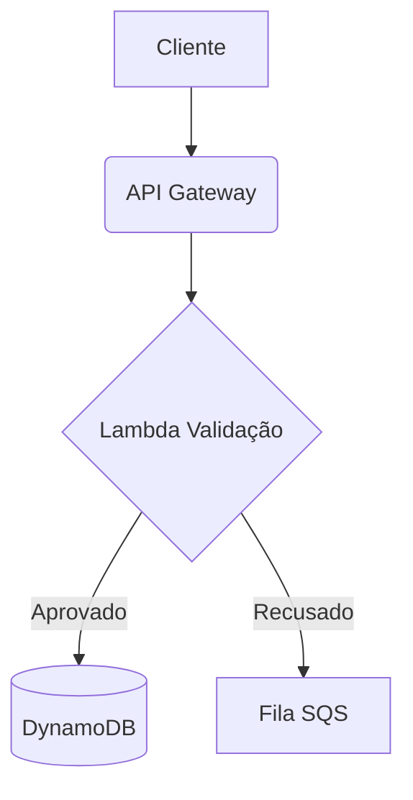

# Resolução — Documentação Completa da Sessão

> **Data:** 20 de fevereiro de 2026  
> **Objetivo:** Aprender a usar o Draw.io como ferramenta de "Docs-as-Code" dentro do VS Code, integrado com IA via MCP.

---

## Visão Geral do que foi feito

Nesta sessão, partimos de uma pasta completamente vazia e construímos um mini projeto de documentação técnica que inclui:

- Diagramas de arquitetura editáveis visualmente (`.drawio.svg`)
- Documentação em Markdown que renderiza os diagramas
- Servidor MCP oficial do Draw.io integrado ao VS Code/Copilot
- Um diagrama de arquitetura AWS gerado por IA

---

## Passo 1 — O Arquivo `.drawio.svg` Vazio

### O que fizemos
O workspace tinha apenas um arquivo chamado `arquitetura-pagamento.drawio.svg`, mas ele estava **completamente vazio**.

A IA foi solicitada a adicionar componentes como se tivesse "arrastado da barra lateral do Draw.io": um ícone de Usuário, um Servidor e um Banco de Dados, conectados por setas.

### Como fizemos
A IA escreveu SVG puro diretamente no arquivo, usando:
- `<circle>` e `<path>` para o boneco de Usuário
- `<rect>` e `<line>` para o Servidor
- `<ellipse>` e `<rect>` para o cilindro de Banco de Dados
- `<path>` com `marker-end` para as setas

### Resultado
O diagrama ficou visível ao abrir o arquivo no **Google Chrome**, com os três componentes e as setas conectando **Usuário → Servidor → Banco de Dados**.

---

## Passo 2 — Problema: "Não vejo nada no VS Code"

### O erro
Ao abrir o arquivo no VS Code, a tela aparecia **completamente vazia** — só um grid branco. O diagrama não aparecia.

### Por que aconteceu
O VS Code tem a extensão **Draw.io Integration** instalada, que intercepta arquivos `.drawio.svg`. Essa extensão **não lê SVG puro** — ela espera o formato proprietário `mxGraphModel` (XML do Draw.io) embutido no arquivo.

O SVG puro funcionava no Chrome porque o Chrome é um renderizador de SVG nativo. Mas o editor Draw.io do VS Code ignora o conteúdo SVG visual e procura pela tag `mxGraphModel` para montar o canvas interativo.

### Como resolvemos

**1. Instalamos a extensão SVG Preview** (`simonsiefke.svg-preview`) para ter preview de SVG puro no VS Code como alternativa.

**2. Reescrevemos o arquivo inteiro** no formato correto `.drawio.svg`, que é um SVG com o `mxGraphModel` embutido no atributo `content=` da tag `<svg>`. Esse formato é o padrão da extensão Draw.io e serve dois propósitos ao mesmo tempo:
   - O SVG visual (lido por browsers e GitHub)
   - O XML `mxGraphModel` (lido pelo editor Draw.io)

```xml
<svg host="app.diagrams.net" content="&lt;mxGraphModel&gt;...&lt;/mxGraphModel&gt;">
  <!-- SVG visual aqui -->
</svg>
```

### Extensões instaladas neste passo

| Extensão | ID | Motivo |
|---|---|---|
| Svg Preview | `simonsiefke.svg-preview` | Preview de SVG puro no VS Code |

---

## Passo 3 — Diagrama Funcionando no VS Code

Após reescrever o arquivo com `mxGraphModel`, ao reabrir o arquivo no VS Code o editor Draw.io carregou corretamente os três componentes:

- 🔵 **Usuário** — ícone de pessoa com estilo Cisco (azul)
- 🔷 **Servidor** — retângulo azul com estilo `mxgraph.network.server`
- 🟢 **Banco de Dados** — cilindro verde com estilo `mxgraph.flowchart.database`
- **Setas** conectando os três em sequência

A partir daí o usuário podia **arrastar novos componentes da barra lateral**, **editar nomes com duplo clique** e **salvar com `Ctrl+S`**.

---

## Passo 4 — Criando a Documentação (README.md)

### O que fizemos
Criamos a pasta `docs/` e dentro dela um arquivo `README.md` que incorpora o diagrama como imagem Markdown:

```markdown
# Documentação da API de Pagamentos


```

### Por que isso é poderoso (Docs-as-Code)
- **No VS Code** (`Ctrl+Shift+V`): o diagrama aparece renderizado no preview do Markdown
- **No GitHub**: o SVG aparece diretamente na página do README
- **Clicando no `.drawio.svg`**: abre o editor visual para modificar os blocos

Um único arquivo serve tanto como imagem de documentação quanto como diagrama editável.

---

## Passo 5 — Configurando o MCP do Draw.io

### O que é MCP
MCP (Model Context Protocol) é um protocolo que permite que IAs (como o GitHub Copilot) usem "ferramentas" externas. Com o servidor MCP do Draw.io, a IA ganha o poder de **criar e abrir diagramas Draw.io** diretamente pelo chat.

### O primeiro erro — pacote inexistente
O nome de pacote passado inicialmente foi `@drawio/mcp-server`. Ao verificar no registro do npm:

```
HTTP 404 — pacote não encontrado
```

### Como encontramos o pacote correto
Foi feita uma busca no npm e encontramos o **pacote oficial** publicado pela JGraph (equipe do Draw.io) em **3 de fevereiro de 2026**:

```
@drawio/mcp  — versão 1.1.2
Publicado por: drawio (oficial)
Licença: Apache-2.0
```

### Arquivo de configuração criado — `.vscode/mcp.json`

```json
{
  "servers": {
    "drawio": {
      "type": "stdio",
      "command": "npx",
      "args": [
        "-y",
        "@drawio/mcp"
      ]
    }
  }
}
```

### Arquivo de configuração criado — `.vscode/settings.json`

```json
{
  "mcp": {
    "servers": {
      "drawio": {
        "type": "stdio",
        "command": "npx",
        "args": [
          "-y",
          "@drawio/mcp"
        ]
      }
    }
  }
}
```

### Segundo problema — servidor não aparecia na lista
Após criar os arquivos, o servidor `drawio` não aparecia no comando `MCP: List Servers` do VS Code.

### Como resolvemos
A IA executou o comando de **Reload Window** do VS Code (`workbench.action.reloadWindow`) para forçar a releitura dos arquivos de configuração. Após o reload, o servidor MCP foi detectado automaticamente.

### Ferramentas disponibilizadas pelo MCP
Após ativar, o servidor expôs 3 ferramentas para a IA:

| Ferramenta | O que faz |
|---|---|
| `open_drawio_xml` | Cria/abre diagramas a partir de XML mxGraph |
| `open_drawio_mermaid` | Converte sintaxe Mermaid em diagrama Draw.io |
| `open_drawio_csv` | Cria diagramas a partir de dados CSV |

---

## Passo 6 — Gerando Diagrama AWS com IA (Teste do MCP)

### O desafio
Converter este snippet Mermaid em um diagrama Draw.io com ícones oficiais AWS:



### Como a IA fez
A IA usou a ferramenta `open_drawio_xml` do MCP para gerar um XML `mxGraphModel` completo com:
- Estilos `mxgraph.aws4.*` para ícones AWS oficiais
- Cores corretas de cada serviço AWS
- Boundary "AWS Cloud" ao redor de todos os componentes
- Setas rotuladas com "Aprovado" (verde) e "Recusado" (vermelho)

### Arquivo gerado
`docs/nova-arquitetura.drawio.svg` com:

| Componente | Ícone AWS | Cor |
|---|---|---|
| Cliente | `mxgraph.aws4.client` | Cinza escuro `#232F3E` |
| API Gateway | `mxgraph.aws4.api_gateway` | Rosa `#E7157B` |
| Lambda Validação | `mxgraph.aws4.lambda` | Laranja `#ED7100` |
| DynamoDB | `mxgraph.aws4.dynamodb` | Roxo `#C925D1` |
| Fila SQS | `mxgraph.aws4.sqs` | Rosa `#E7157B` |

O MCP também abriu o diagrama no browser para confirmação visual em tempo real.

---

## Estrutura Final do Projeto

```
Draw.io/
├── .vscode/
│   ├── mcp.json                        ← config MCP (formato VS Code)
│   └── settings.json                   ← config MCP alternativa
├── arquitetura-pagamento.drawio.svg    ← diagrama: Usuário → Servidor → BD
├── Resolução.md                        ← este arquivo
└── docs/
    ├── README.md                       ← documentação com os dois diagramas
    └── nova-arquitetura.drawio.svg     ← diagrama AWS gerado por IA
```

---

## Extensões Instaladas

| Extensão | ID | Para que serve |
|---|---|---|
| Draw.io Integration | `hediet.vscode-drawio` | Editar `.drawio.svg` visualmente no VS Code (já estava instalada) |
| Svg Preview | `simonsiefke.svg-preview` | Preview de SVG puro no VS Code |

---

## Erros Encontrados e Soluções

| # | Erro | Causa | Solução |
|---|---|---|---|
| 1 | Diagrama não aparecia no VS Code | SVG puro não é lido pelo editor Draw.io | Reescrever o arquivo com `mxGraphModel` embutido |
| 2 | Pacote `@drawio/mcp-server` retornou 404 | Nome fictício, pacote não existe | Pesquisar no npm e usar o pacote oficial `@drawio/mcp` |
| 3 | Servidor MCP não aparecia na lista | VS Code não releu as configs | Executar `Reload Window` para forçar detecção |

---

## Conceitos Aprendidos

### `.drawio.svg` — O formato duplo
Um arquivo `.drawio.svg` é simultaneamente:
- Um **SVG válido** (renderizável em qualquer browser ou no GitHub)
- Um **diagrama Draw.io editável** (via o atributo `content` com o XML `mxGraphModel` codificado)

### Docs-as-Code com Draw.io
Ao referenciar `.drawio.svg` em um `README.md`, você tem:
- Diagrama que aparece no GitHub automaticamente
- Diagrama editável visualmente no VS Code
- Versionável pelo Git como qualquer outro arquivo de código

### MCP (Model Context Protocol)
Protocolo que expõe "ferramentas" para IAs. Com o `@drawio/mcp`, a IA passa a poder:
- Criar diagramas programaticamente
- Converter Mermaid → Draw.io
- Abrir diagramas no browser para revisão visual

---

*Documentação gerada ao final da sessão — 20/02/2026*
